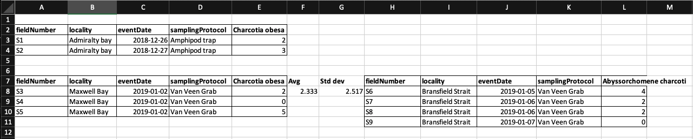

# Tidy data

This section of the document compiled information from several references:

- [R for Data Science](https://r4ds.had.co.nz/tidy-data.html#tidy-data-1) 
- [Tidy Data by Hadley Wickham](http://www.jstatsoft.org/v59/i10/paper)
- [Data Organization in Spreadsheets for Ecologists](https://datacarpentry.org/spreadsheet-ecology-lesson/)
- [Data Organization in Spreadsheets](https://doi.org/10.1080/00031305.2017.1375989)
- [Nine simple ways to make it easier to (re)use your data.](https://ojs.library.queensu.ca/index.php/IEE/article/view/4608)


Tidy data is a standard way of mapping the meaning of a dataset to its structure. 

In tidy data:

- Columns = variables
- Rows = observations
- Cells = data (values)


## Why tidy data?

As discussed in [R for Data Science](https://r4ds.had.co.nz/tidy-data.html#tidy-data-1) and [Tidy Data by Hadley Wickham](http://www.jstatsoft.org/v59/i10/paper), tidy data brings 2 main advantages:

1. Consistent data structure means that it will be easier to learn tools that work with it due to the uniformity.
2. The layout of tidy data ensures that the values of each variables from the same observation are always paired. This properties is particularly well suited for vectorized programming languages such as R. 
 

## Common spreadsheets mistakes

This section contains content adapted from:

- [Data Organization in Spreadsheets for Ecologists from Data Carpentry](https://datacarpentry.org/spreadsheet-ecology-lesson/02-common-mistakes/index.html)
- [Data Organization in Spreadsheets](https://doi.org/10.1080/00031305.2017.1375989)

Common spreadsheets mistakes:

- [Using multiple tables](#using-multiple-tables)
- [Using multiple tabs](#using-multiple-tabs)
- [Not filling in zeros](#not-filling-in-zeros)
- [Using problematic null values](#using-problematic-null-values)
- [Using formatting to convey information](#using-formatting-to-convey-information)
- [Using formatting to make the data sheet look pretty](#using-formatting-to-make-the-data-sheet-look-pretty)
- [Placing comments or units in cells](#placing-comments-or-units-in-cells)
- [Entering more than one piece of information in a cell](#entering-more-than-one-piece-of-information-in-a-cell)
- [Using problematic field names](#using-problematic-field-names)
- [Using special characters in data](#using-special-characters-in-data)
- [Inclusion of metadata in data table](#inclusion-of-metadata-in-data-table)
- [Date formatting](#date-formatting)


### [Using multiple tables](#using-multiple-tables)

Creating multiple data tables within one spreadsheet confuses the computer as false associations between things are created for the computer, which interpret each row as an observation. Same field name is also probably being used in multiple places, which will make it harder for you to tidy the data into a usable form. 



```{r message=FALSE}
library(readxl)
library(here)
library(tidyverse)

# extract row where fieldNumber == S3
df <- read_excel(here("examples/tidy-data_spreadsheets/tidy-data_multi-tables.xlsx")) %>% filter(fieldNumber == "S3")

head(df)
```

In the example above, the computer will see (for example) row 8 and assume that all columns A-L refer to the same sample. However, this row represents 2 distinct samples (Charcotia obesa from fieldNumber S3 and Abyssorchomene charcoti from fieldNumber S6), as well as some calculated summary statistics (an average (avg) and standard deviation) for species 1 from fieldNumber S3, S4 and S5. 

### [Using multiple tabs](#using-multiple-tabs)

When extra tabs are created, computer will not be able to see the connections in the data that are there (you have to introduce spreadsheet application-specific functions or scripting to ensure this connection). For instance, separate tab is created for each day you take a measurement.

This isn't good practice for two reasons: 

1) Inconsistencies are more likely to be introduced into your data
2) Extra step is needed to combine all data from separate tabs into a single data table before analysis. You will have to explicitly tell the computer how to combine tabs - and if the tabs are inconsistently formatted, you might even have to do it manually.

Most of the time adding another column to the original spreadsheet could resolve the problem. In the example mentioned, adding a `date` column could avoid having multiple tabs of measurements for each day.


### [Not filling in zeros](#not-filling-in-zeros)

There’s a difference between a zero and a blank cell in a spreadsheet to the computer:

- a zero is an actual data. You measured or counted it. 
- A blank cell is a null (missing) value, meaning that it wasn't measured.

The spreadsheets or statistical programs will likely misinterpret blank cells that you intend to be zeros. By not entering the value of your observation, you are telling your computer to represent that data as unknown or missing (null). This can cause problems with subsequent calculations or analyses. 

For example, the average of a set of numbers which includes a single null value is always null (because the computer can’t guess the value of the missing observations). Because of this, it’s very important to record zeros as zeros and truly missing data as nulls.

### [Using problematic null values](#using-problematic-null-values)

Missing (null) values should be represented consistently throughout the dataset and should be differentiated from the value 0.

White et al. presented great examples of different types of commonly used null values, the problems imposed by the types of null values, compatibility with programming languages and their recommendations in [Nine simple ways to make it easier to (re)use your data.](https://ojs.library.queensu.ca/index.php/IEE/article/view/4608) in Data Sharing in Ecology and Evolution.


Table: Null values are indicated as being a null value for specific software if they work consistently and correctly with that software. For example, the null value “NULL” works correctly for certain applications in R, but does not work in others, so it is not presented in the table as R compatible.

There are a few reasons why null values get represented differently within a dataset. 

- Confusing null values are automatically recorded from the measuring device. If that’s the case, there’s not much you can do, but it can be addressed in data cleaning before analysis. 
- Different null values are used to convey different reasons why the data is missing. Following tidy data principles, it is better to create a new column like ‘data_missing’ and use that column to capture the different reasons.

### [Using formatting to convey information](#using-formatting-to-convey-information)

Most of the time, formatting such as highlighting could be encoded into a separate column.


Example: highlighting cells, rows or columns that encode certain information, leaving blank rows to indicate separations in data.


Solution: create a new field to encode the life stage of each occurrence record.

### [Using formatting to make the data sheet look pretty](#using-formatting-to-make-the-data-sheet-look-pretty)

Example: Cell merging


Merging cells could confuse the computer to see associations in data. Merged cells will make the data unreadable by statistical software.

```{r}
read_excel(here("examples/tidy-data_spreadsheets/tidy-data_merge-cells.xlsx"))
```

Note that when reading the spreadsheet, the value of merged cells is only interpreted by the function once and assigned to the first record. Hence it is advisable to have the data in each row.

```{r}
read_excel(here("examples/tidy-data_spreadsheets/tidy-data_merge-cells_correct.xlsx"))
```

### [Placing comments or units in cells](#placing-comments-or-units-in-cells)

Example: A coordinate of a field site was not recorded from GPS device while in the field. The coordinate is later on included the data with a comment to indicate that the coordinate is obtained from a map.


```{r}
read_excel(here("examples/tidy-data_spreadsheets/tidy-data_comment-cells.xlsx"))
```
Note that the comment is not visible in the data when read by R.

Solution: Excel comments are not readable by most analysis software. To resolve this, create another field in the table to add notes or flag this cells. 

```{r}
read_excel(here("examples/tidy-data_spreadsheets/tidy-data_comment-to-column.xlsx"))
```

Similarly, do not include units in the same cell that contains the measurement value. Ideally, all measurements taken should be in the same unit. If for some reason they aren't, create another field to specify the unit.

### [Entering more than one piece of information in a cell](#entering-more-than-one-piece-of-information-in-a-cell)

Example: Recording coordinates in a single column.

```{r}
read_excel(here("examples/tidy-data_spreadsheets/tidy-data_multi-value-per-cell.xlsx"))
```

Solution: 

While it is tempting to record a coordinate in a column, it is not a good practice for several reasons:

- software such as excel might interpret it as a formula and subtract the 2 negative values in `coordinate` column.
- inconsistencies such as different delimiters and the order of values maybe introduced while entering the data. 
- the field will have to be split for tools that work with tidy data.

Including multiple values in a cell limits the ways in which you can analyze your data. It is better to split the field `coordinate` into `decimalLatitude` and `decimalLongitude` as shown in the figure below.


### [Using problematic field names](#using-problematic-field-names)

Problematic field names include field names which has one or more of the followings:

character | reason
:--|:--
spaces | maybe misinterpreted as delimiters
numbers | some programs don’t like field names that are text strings that start with numbers. Some R packages append an `X` at the beginning of field name if it starts with number.
special characters ($, @, %, #, &, *, (, ), !, /, etc.) | often have special meaning in programming languages

For instance, importing a spreadsheet with field names that begin with number, contain spaces and special character as shown in figure below with `read.xlsx` function from `xlsx` package will lead to a change in field names.


```{r}
library(xlsx)
read.xlsx(here("examples/tidy-data_spreadsheets/tidy-data_problematic-field-names.xlsx"), sheetIndex = 1)
```
We recommend to use underscores (`_`) as alternative to spaces or consider writing field names in camel case (e.g.: exampleFileName) to improve readability. Abbreviations might make sense temporarily but it maybe hard to recalled after a prolonged period of time. Units can be included in field name to avoid confusion. (e.g. minimumDepthInMeters)

Good name | Good alternative | Avoid
---|---|---
max_temp_in_celsius | maxTempInCelsius | Maximum Temp (°C)
decimal_latitude | decimalLatitude | lat
mean_year_growth | meanYearGrowth | Mean growth/year
sex | sex | M/F


### [Using special characters in data](#using-special-characters-in-data)

Using spreadsheet as a word processor when entering data by including line breaks, em-dashes, non-standard characters such as (left- or right-aligned quotation marks) not only makes the data less readable, 


The data looks fine in the excel file above. However when reading the file into excel, following happens. The carriage of the label becomes `\r\n_x000D_` when read by R.

```{r}
special_char <- read_excel(here("examples/tidy-data_spreadsheets/tidy-data_special-char.xlsx"))
special_char
```
When the data frame is being written into a tab separated value file and read back into R, `\r\n` is treated as new line when writing the file. 

```{r message=FALSE}
library(tidyverse)
file_path <- here("examples/tidy-data_written/tidy-data_special-char.txt")
write_tsv(special_char, file_path)
read_tsv(file_path)
```


### [Inclusion of metadata in data table](#inclusion-of-metadata-in-data-table)

Clear field names of a data table is a good practice, however the amount of information that it can hold is limited and over time, the information will be loss if it is not well documented. The chances that you will remember what the field names means after a prolonged period of time is slim. On the other hand, a good documentation helps the others to understand your data, verify your findings and to review your works.

However, the data about your data (metadata) should not be contained in the data file itself because this information is not data. Including it within the same file could disrupt how computer programs interpret your data file. It is better to store this metadata in a separate file in the same directory as your data file, preferably with a name that clearly associates it with your data file.

Additionally, file or database level metadata should contains information below:

- relationship between files that make up the dataset
- format of the files
- whether they supercede or are superceded by previous files

### [Date formatting](#date-formatting)

If you are using spreadsheet program such as microsoft excel to manage date data, it is important to understand how Excel treats this piece of information. Data Carpentry has a [chapter](https://datacarpentry.org/spreadsheet-ecology-lesson/03-dates-as-data/index.html) that explains this very well.

To summarize, dates are stored as number of days (integers) from a [default of December 31, 1899 or December 31, 1903](https://docs.microsoft.com/en-US/office/troubleshoot/excel/1900-and-1904-date-system) in Excel. It has its pros and cons but because different version of Excel could have different default values and formats, we recommend the following when storing dates in excel.

Split the date into year, month, day or storing dates as a single string in the form of `YYYYMMDD`.

year | month | day
:--|:--|:--
2021 | 08 | 26


startDate | endDate 
:--|:--
20210801 | 20210826 


